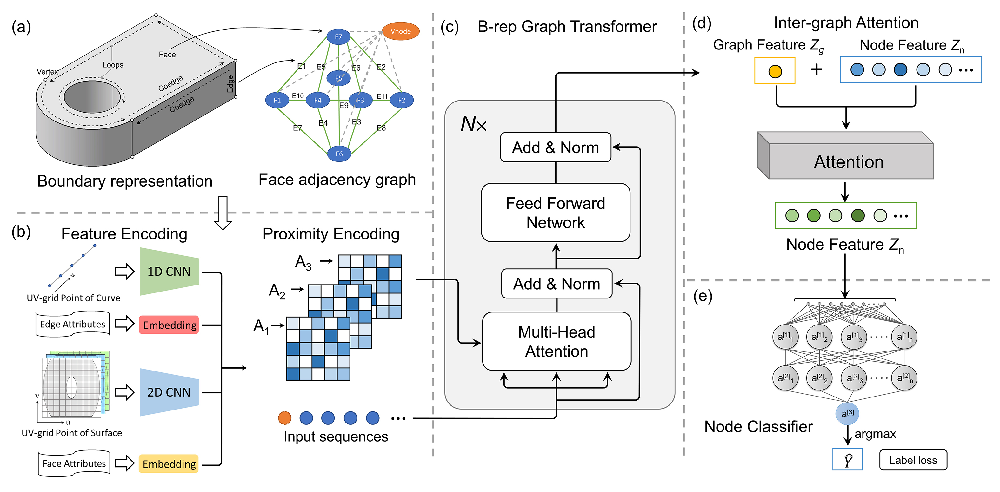

# BrepMFR

Code for BrepMFR: Enhancing machining feature recognition in B-rep models through deep learning and domain adaptation.



## About BrepMFR

BrepMFR, a novel deep learning network designed for machining feature recognition on B-rep models within the CAD/CAM domain. The original B-rep model is converted into a graph representation for network-friendly input, where graph nodes and edges respectively correspond to faces and edges of the original model. Subsequently, we leverage a graph neural network based on the Transformer architecture and graph attention mechanism to encode both local geometric shape and global topological relationships, achieving high-level semantic extraction and prediction of machining feature categories. Furthermore, to enhance the performance of neural networks on real-world CAD models, we adopt a two-step training strategy within a novel transfer learning framework.

## Preparation

### Environment setup

```
git clone https://github.com/zhangshuming0668/BrepMFR.git
cd BrepMFR
conda env create -f environment.yml
conda activate brep_mfr
```

### Data preparation

Our synthetic CAD datasets have been publicly available on [Science Data Bank](https://www.scidb.cn/en/detail?dataSetId=931c088fd44f4d3e82891a5180f10d90)

## Training

For machining feature recognition, the network can be trained using:
```
python segmentation.py train --dataset_path /path/to/dataset --max_epochs 1000 --batch_size 64
```

The logs and checkpoints will be stored in a folder called `results/BrepMFR` based on the experiment name and timestamp, and can be monitored with Tensorboard:

```
tensorboard --logdir results/<experiment_name>
```

## Testing

The best checkpoints based on the smallest validation loss are saved in the results folder. The checkpoints can be used to test the model as follows:

```
python segmentation.py test --dataset_path /path/to/dataset --checkpoint ./results/BrepMFR/best.ckpt --batch_size 64
```

